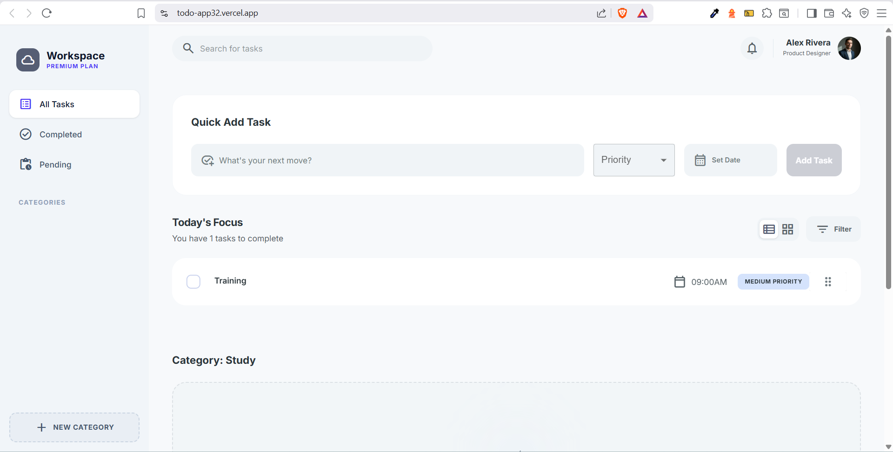

## 📸 Preview

# Todo App 📝

A simple and responsive Todo List application built with React. This project helps users manage their daily tasks efficiently by adding, editing, completing, and deleting todos.

---

## 🚀 Features

* Add new tasks
* Mark tasks as completed
* Delete tasks
* Filter tasks (All / Active / Completed)
* Responsive design for all devices
* Clean and modern UI

---

## 🛠️ Tech Stack

* React.js
* JavaScript (ES6+)
* Tailwind CSS (or CSS3 if used)
* Vite (if applicable)

---


## 📦 Installation

Clone the repository:

```bash
git clone https://github.com/Basem6/todo-app
```

Install dependencies:

```bash
npm install
```

Run the development server:

```bash
npm run dev
```

---

## 🧠 Learning Goals

This project was built to practice:

* React components & hooks
* Props handling
* UI/UX design
* Responsive layout

---

## 📌 Future Improvements

* Add backend (Firebase / Node.js)
* User authentication
* Drag & drop tasks
* Due dates & reminders

---

## 👨‍💻 Author

Frontend Developer passionate about React and modern web technologies.

---
